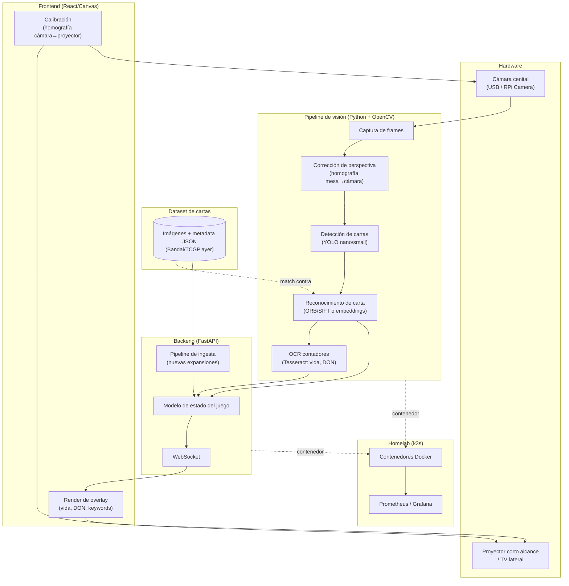

# Arquitectura del sistema

Diagrama de componentes y flujo de datos de Sky-Cardsense. Ver también el [documento de contexto](../sky-cardsense-context.md) para el detalle de cada desafío técnico.

## Diagrama de componentes

## Componentes

| Componente | Responsabilidad |
|---|---|
| **Cámara cenital** | Captura continua de la mesa desde arriba. |
| **Pipeline de visión** | Corrige perspectiva, detecta cartas candidatas (YOLO), las identifica por feature matching contra el dataset, y lee contadores manuales con OCR. |
| **Dataset de cartas** | Imágenes de referencia + metadata (nombre, coste, texto de habilidad) en JSON, usado como base de comparación para el reconocimiento. |
| **Backend (FastAPI)** | Mantiene el modelo de estado del juego (qué cartas están en mesa, vida, DON) y lo publica en tiempo real por WebSocket. También corre el pipeline de ingesta cuando se agregan nuevas expansiones al dataset. |
| **Frontend (React/Canvas)** | Consume el WebSocket y dibuja el overlay (vida, DON, referencias de keywords). Incluye la pantalla de calibración cámara→proyector. |
| **Proyector / TV** | Salida visual del overlay sobre la mesa (proyección) o al costado (TV, modo alternativo). |
| **Homelab (k3s)** | Despliegue containerizado del pipeline de visión y el backend, con métricas en Prometheus/Grafana. |

## Flujo de datos (ciclo por frame)

1. La cámara captura un frame de la mesa.
2. Se aplica la homografía **mesa→cámara** para corregir la perspectiva (la mesa se ve como un rectángulo plano).
3. YOLO detecta regiones candidatas a carta dentro del frame corregido.
4. Cada región se compara contra el dataset (ORB/SIFT o embeddings) para identificar qué carta es.
5. Tesseract lee contadores manuales (vida, DON) si están presentes en el frame.
6. El resultado combinado (cartas identificadas + contadores) actualiza el modelo de estado del juego en el backend.
7. El backend publica el nuevo estado por WebSocket.
8. El frontend recibe el estado y redibuja el overlay.
9. El overlay se proyecta sobre la mesa aplicando la homografía **cámara→proyector** (calibrada una sola vez, no por frame) para que el dibujo caiga sobre la carta correcta.

## Dos homografías distintas

Un punto clave de la arquitectura es que hay **dos calibraciones geométricas independientes**:

- **Mesa → cámara**: corrige la distorsión de perspectiva de la imagen capturada, para que el análisis de visión trabaje sobre un plano rectificado.
- **Cámara → proyector**: traduce coordenadas de "carta detectada en la imagen de cámara" a "píxel del proyector" para que el overlay caiga exactamente sobre la carta física en la mesa. Se resuelve una vez en la calibración inicial (patrón de puntos) y no cambia salvo que se muevan cámara o proyector.

## Despliegue

El pipeline de visión y el backend corren como contenedores Docker, desplegados en el cluster **k3s** del homelab existente (Traefik/Flannel/local-path-provisioner), con métricas expuestas a **Prometheus** y visualizadas en **Grafana**. El frontend puede servirse como estático desde el mismo cluster o correr localmente en el dispositivo conectado al proyector/TV.
